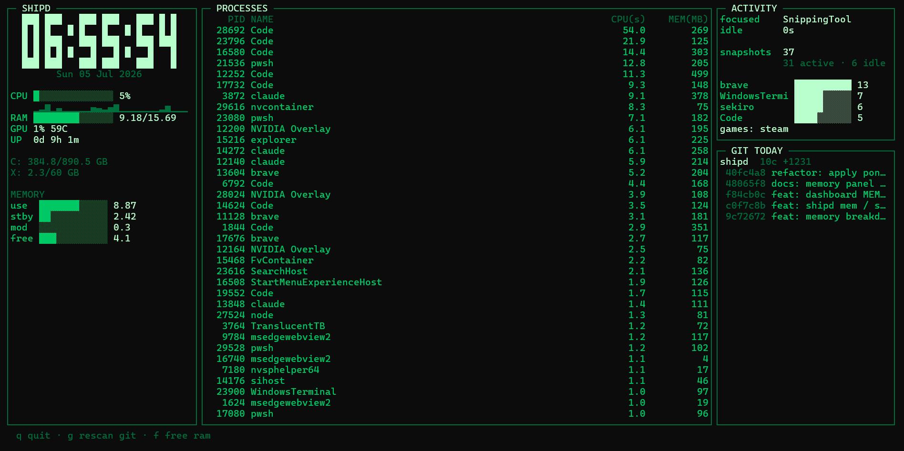

# shipd

A daily dev + activity report for Windows, written in pure PowerShell. No dependencies, no accounts, no telemetry — all data stays in this folder.

Every 10 minutes it takes a silent snapshot of what you're doing (focused app, idle time, running games). Every evening it builds a report combining that with your git commits across all your projects, plus system stats.



## Requirements

- Windows 10/11
- [PowerShell 7+](https://aka.ms/powershell) (`pwsh`) — the built-in Windows PowerShell 5 will not work
- git (for the commit report)

## Setup

```powershell
git clone https://github.com/harsh4k/shipd.git
cd shipd
notepad config.json     # point git_roots at YOUR projects folder (important!)
.\shipd.ps1 install     # adds the 'shipd' command to your terminal
.\shipd.ps1 schedule    # starts background snapshots + the daily report
```

Open a **new** terminal, and `shipd` works from any folder.

## Commands

| Command | What it does |
|---|---|
| `shipd` | Live dashboard in your terminal |
| `shipd report` | Today's report (also saved to `reports\<date>.txt`) |
| `shipd report 2026-07-01` | Report for a past date |
| `shipd list` | List all saved reports |
| `shipd snapshot` | Take one activity snapshot manually |
| `shipd mem` | RAM breakdown: in use / standby cache / modified / free |
| `shipd free` | Free RAM by purging the standby cache (admin prompt; also the `f` key in the dashboard) |
| `shipd stop` / `shipd start` | Pause / resume background tracking |
| `shipd restart` | Re-register the scheduled tasks (run after editing `config.json`) |
| `shipd unschedule` | Remove the scheduled tasks completely |
| `shipd install` | Add the `shipd` command to your PowerShell profile |

## Freeing RAM (RAMMap-lite)

Windows keeps closed apps' data in RAM as **standby cache**, which is why Task
Manager can show 90% memory used while nothing is running. The dashboard's
MEMORY panel shows the real split, and pressing **f** (or running `shipd free`)
purges the standby cache — the same operation as Sysinternals RAMMap's
"Empty Standby List" — and shows how much was released.

This is manual-only (the background tasks never touch it) and non-destructive:
it only drops cache, never running apps' memory. The one trade-off is that the
next launch of a recently closed app may be marginally slower while Windows
re-reads it from disk. Needs one UAC click; declining it simply cancels.

## Configuration — `config.json`

| Key | Meaning | Default |
|---|---|---|
| `git_roots` | Folders scanned (recursively) for git repos with commits today | `["X:\\Projects"]` |
| `known_games` | Process names counted as gaming in the report | steam, valorant, cs2, … |
| `idle_threshold_seconds` | A snapshot counts as "idle" past this much inactivity | `300` |
| `snapshot_interval_minutes` | How often background snapshots run | `10` |
| `report_time` | When the daily report auto-generates (24h) | `"21:00"` |

After changing `snapshot_interval_minutes` or `report_time`, run `shipd restart`.

## How it works

- `shipd schedule` registers two Windows Task Scheduler tasks: **shipd snapshot** (every N minutes) and **shipd report** (daily). Nothing runs when you're logged out.
- Tasks launch through `hidden.vbs` so no console window flashes — **don't delete that file**, it's what keeps background runs invisible.
- Snapshots are appended to `snapshots.jsonl`; reports are plain text in `reports\`.

## Privacy

Snapshots record your focused app, idle time, and the names of running processes. Everything is stored **locally** in this folder and never sent anywhere. Both `snapshots.jsonl` and `reports\` are gitignored, so your activity data can't end up in a commit.

## Troubleshooting

- **"running scripts is disabled"** → `Set-ExecutionPolicy -Scope CurrentUser RemoteSigned`
- **`shipd` not recognized** → run `.\shipd.ps1 install`, then open a new terminal
- **Report shows no commits** → check `git_roots` in `config.json` actually contains your repos
- **No snapshots appearing** → `Get-ScheduledTask 'shipd snapshot'` should show *Ready*; if missing, run `shipd schedule`

## Tests

```powershell
.\test_shipd.ps1
```
